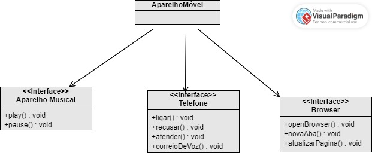

# Projeto iPhone - Desafio de Modelagem UML e Código

Este projeto tem como objetivo criar a representação de um iPhone, incluindo funcionalidades de Reprodutor Musical, Aparelho Telefônico e Navegador na Internet. As interfaces e implementações Java correspondentes foram desenvolvidas com base nas seguintes especificações:

## Comportamentos Esperados

### Reprodutor Musical

- `tocar()`: Inicia a reprodução de música.
- `pausar()`: Pausa a reprodução de música.
- `selecionarMusica(String musica)`: Seleciona uma música para reprodução.

### Aparelho Telefônico

- `ligar()`: Inicia uma chamada telefônica para um número específico.
- `atender()`: Atende a uma chamada telefônica.
- `iniciarCorreioVoz()`: Inicia o correio de voz.

### Navegador na Internet

- `exibirPagina()`: Exibe uma página da web com a URL especificada.
- `adicionarNovaAba()`: Adiciona uma nova aba ao navegador.
- `atualizarPagina()`: Atualiza a página atual do navegador.

## Diagrama UML

Aqui está o diagrama UML que representa a estrutura do projeto:
